# patchtree

Chrome/Firefox extension that turns raw `.diff` / `.patch` URLs into a
full-featured code review UI — with tree-sitter syntax highlighting and
review workflows for **GitLab** (any instance, including self-hosted) and
**GitHub**.

Open `https://gitlab.example.com/group/project/-/merge_requests/104.diff`
(or click the extension icon on any MR/PR page) and review right there.

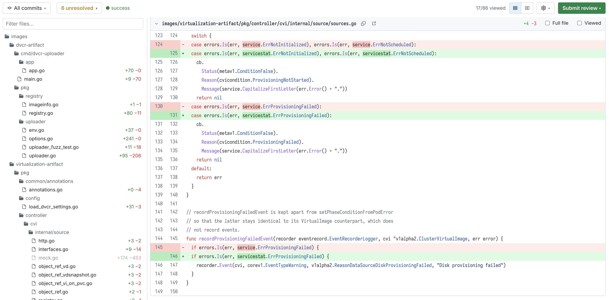

## Features

### Diff rendering

- Renders any plain-text `*.diff` / `*.patch` page, whatever served it.
- **Inline and side-by-side** views; fully added/deleted files take the
  full width in split mode.
- **Word-level diff**: changed words inside modified line pairs get a
  stronger tint (LCS over tokens), layered under syntax colors.
- **Syntax highlighting** with real parsers (web-tree-sitter, wasm, run in
  the background worker): go, js/ts/tsx, python, bash, json, yaml, rust,
  c, c++, java, ruby, php, c#, lua, toml, hcl/terraform, css, html, and
  Helm/Go templates (`.tpl`, and any `.yaml` containing `{{ … }}` actions).
- **Expand hidden lines** between hunks (fetched from the repository at
  the head revision, highlighted and commentable) or the **Full file**
  toggle per file.
- Large diffs stay fast: only visible file sections are rendered.

### Navigation

- Resizable, filterable **file tree** (filter matches paths *and* diff
  content), folder icons, per-file `+N −M`, comment-count badge.

  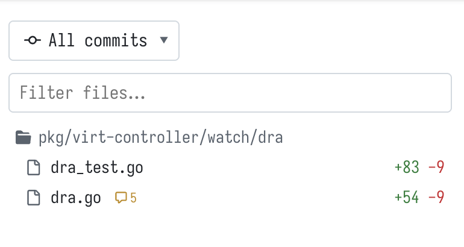
- **Viewed** checkboxes with an `N/M viewed` progress counter,
  fold/unfold, auto-collapsed `generated` files (lock files, `*.pb.go`,
  `vendor/`, minified assets).
- **Keyboard**: `j`/`k` files, `n`/`p` threads (centered), `v` viewed,
  `x` fold, `/` focus filter.
- **Commit filter** dropdown — view the diff of a single commit.

  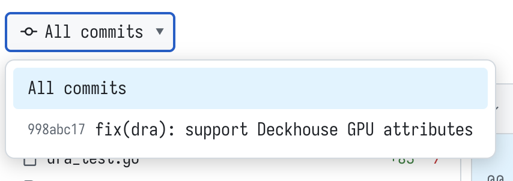
- Alt-click a line number → copy a **permalink** to that line's blob.
- Copy-path and open-at-head buttons in every file header.

### Review

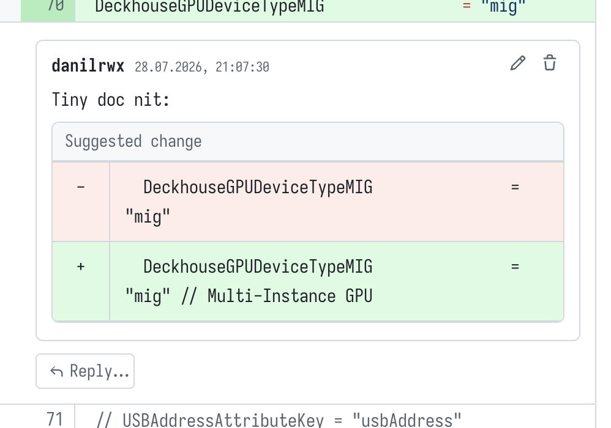

- **Threads on lines** (anchored to the old or new side, half-width in
  split view), replies, edit and delete of your comments.
- **Markdown everywhere**: toolbar (heading, bold, italic, code, lists),
  Write/Preview tabs, rendered through the platform's own markdown API.
- **Suggestions**: one click inserts a ```suggestion``` block prefilled
  with the commented line; existing suggestions render as a red/green
  widget with **Apply suggestion** (GitLab).
- **Multiline comments**: shift-click a line number to extend the range.

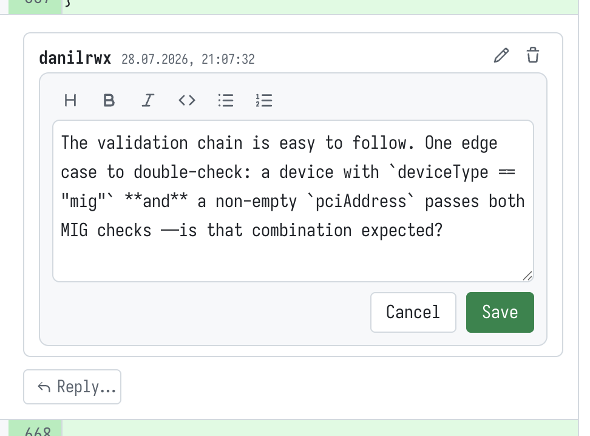
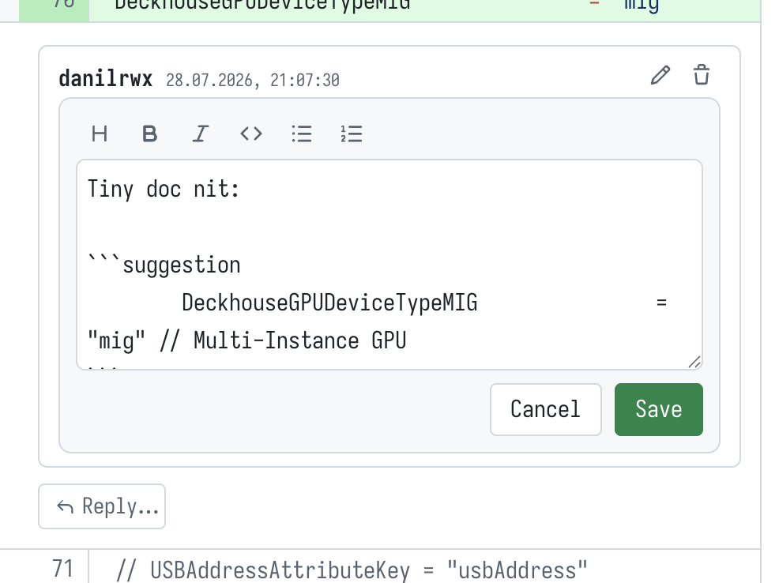
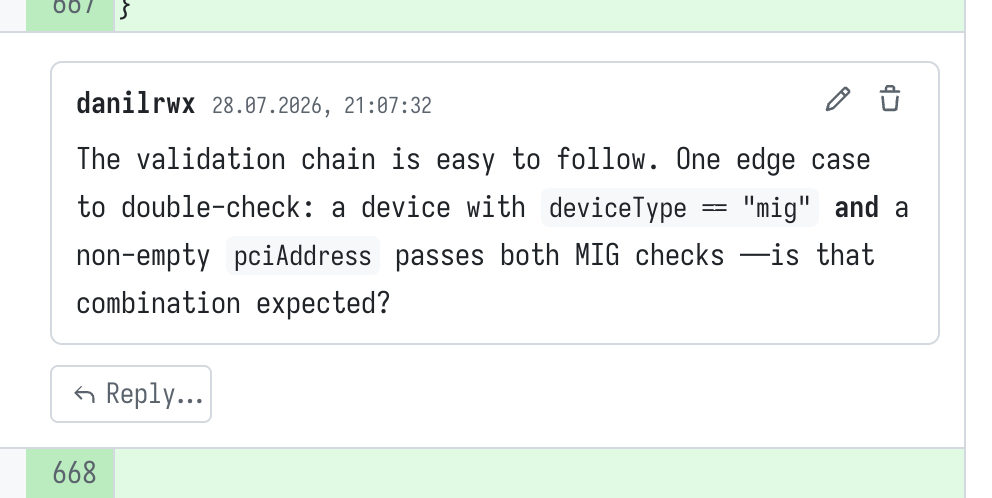
- **Resolve/unresolve** threads (GitLab) and an **unresolved dropdown**
  in the toolbar that jumps to each open thread.

  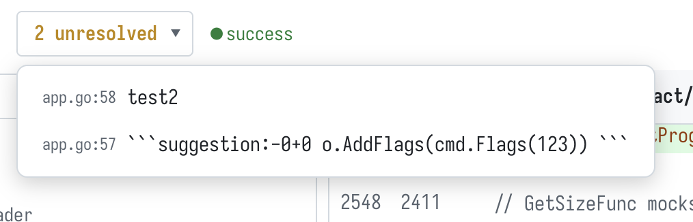
- **Draft reviews** (GitLab): “Add to review” collects pending comments,
  published together by Submit review.
- **Submit review** panel: summary comment + Comment / Approve (or
  Unapprove) / Request changes; approval state shown as a badge.

  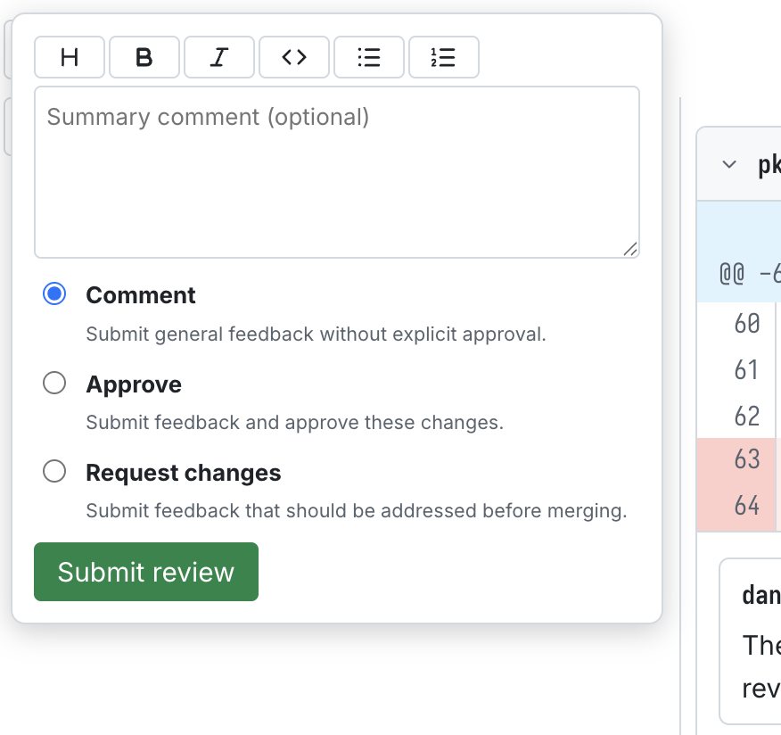
- General (non-diff) MR/PR discussion rendered above the first file.
- Pipeline/checks status and merge-conflict indicator in the toolbar.

### Appearance

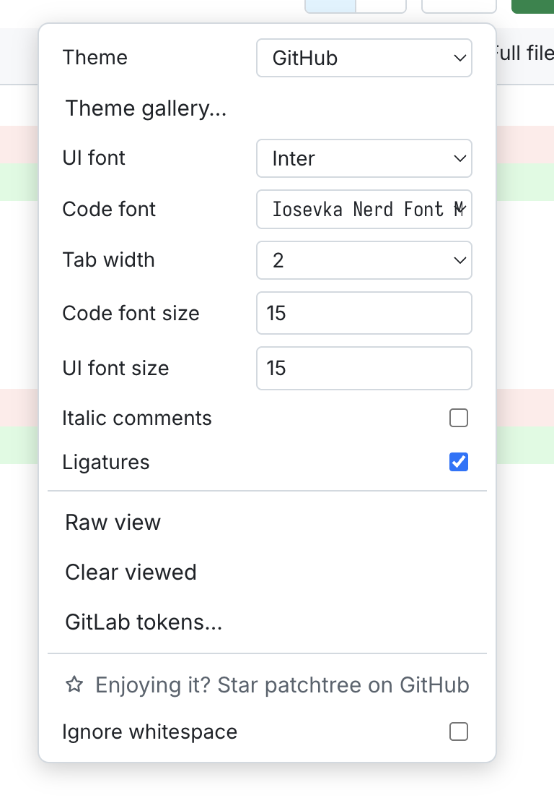

- **Theme gallery**: all 500+ base16/base24 schemes from
  [tinted-theming](https://github.com/tinted-theming/schemes) (MIT) with
  live code previews, search, light/dark filter — plus paste-your-own
  scheme yaml.
- Bundled fonts: JetBrains Mono, Inter and Nerd Font Mono builds of
  JetBrainsMono / FiraCode / Hack / MesloLGS / Iosevka; any local font by
  name; separate UI/code font sizes, tab width, italic comments and
  ligatures toggles.

  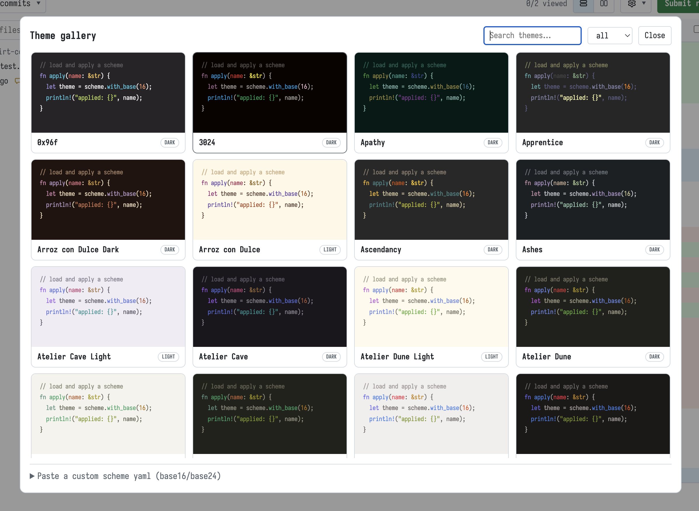

## Install

Binary assets (wasm grammars, fonts, highlight queries, theme data) are
not stored in git — the default make target fetches them from pinned
upstream releases:

```sh
git clone https://github.com/danilrwx/patchtree
cd patchtree
make          # needs node+npm and curl; re-runs are no-ops (FORCE=1 to refetch)
```

Then `chrome://extensions` → Developer mode → Load unpacked → this
directory. To enable review actions, open the ⚙ menu → **Access
tokens** on any diff page and add a GitLab host (PAT scope `api`) and/or
a GitHub token (classic `repo`, or fine-grained with Pull requests
read & write); rendering works without tokens. Tokens are stored in
`storage.local` and never synced.

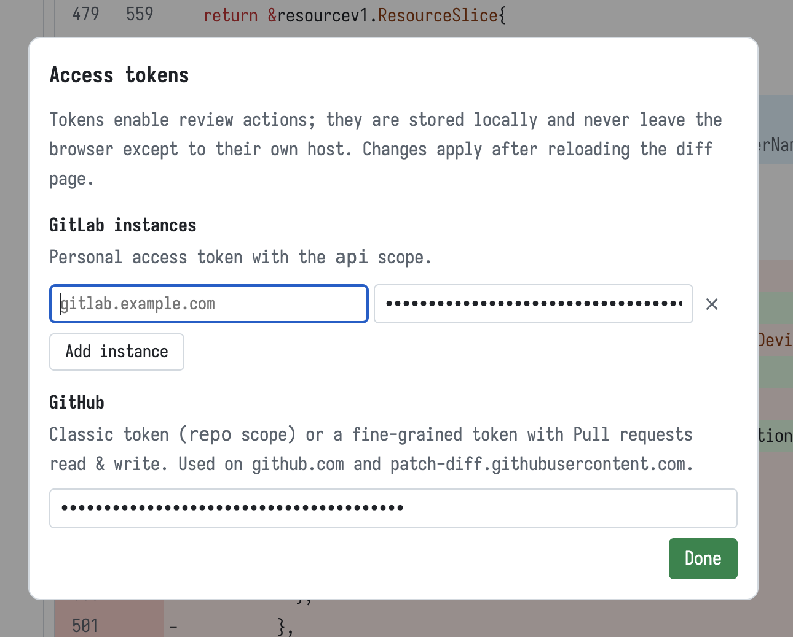

Make sure the extension's **Site access** is “On all sites” (or grant
your hosts explicitly) — without it the content script is not injected.

## Firefox

`make zip-firefox` builds `patchtree-firefox.zip` with an event-page
background and the gecko id. For development load it via
`about:debugging` → Load Temporary Add-on. Permanent installs need
signing: CI signs an unlisted `.xpi` through AMO on tags when
`AMO_JWT_ISSUER`/`AMO_JWT_SECRET` secrets are configured. Firefox MV3
treats host permissions as opt-in — enable “Access your data for all
websites” in the add-on's Permissions tab.

## Build / release

- `make` — fetch all pinned assets (`vendor`, `queries`, `fonts`,
  `themes`); each target skips work when files are already present.
- `make check` — syntax-check the sources.
- `make zip` / `make zip-firefox` — build distribution archives.
- `make clean` — remove fetched assets and archives.

CI (`.github/workflows/release.yml`) rebuilds every asset from the pinned
upstream versions on each push and attaches the archives plus sha256
checksums to the GitHub Release on `v*` tags — nothing binary is taken
from the repository, so artifact contents are fully traceable:

- `web-tree-sitter` + grammar wasm builds — npm packages
  (`scripts/fetch-vendor.sh`).
- Highlight queries — grammar repos at matching tags
  (`scripts/fetch-queries.sh`).
- Fonts — upstream releases, Nerd Font ttf converted to woff2 with the
  ttf2woff2 npm package (`scripts/fetch-fonts.sh`).
- Themes — tinted-theming schemes at a pinned commit
  (`scripts/fetch-themes.sh`).

To release: `git tag v0.2.0 && git push --tags`.

## License

MIT (see [LICENSE](LICENSE)) — copies must retain the copyright notice.
Bundled third-party assets keep their own licenses: web-tree-sitter and
the grammars (MIT), JetBrains Mono / Inter (OFL), Nerd Fonts patched
fonts (MIT + upstream font licenses), tinted-theming schemes (MIT).
