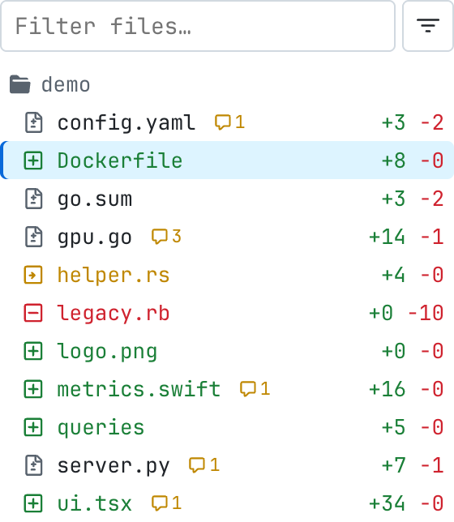
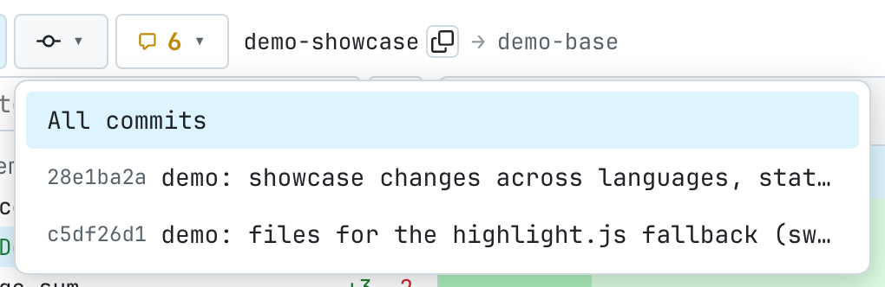
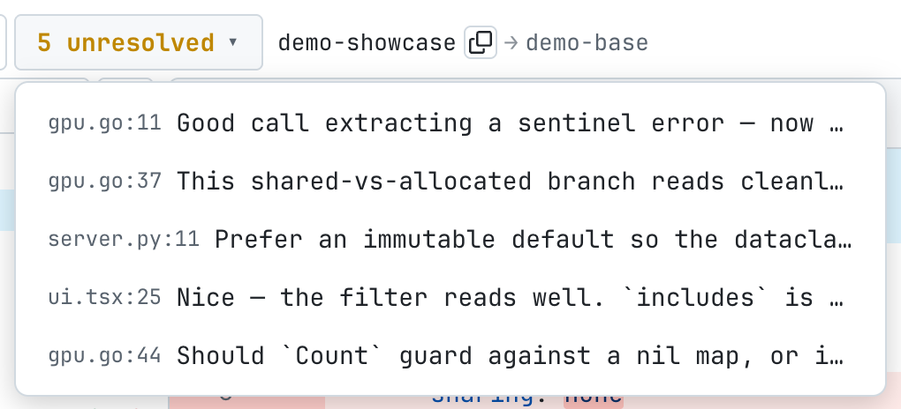
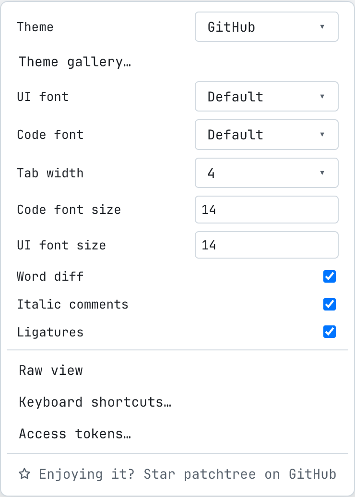
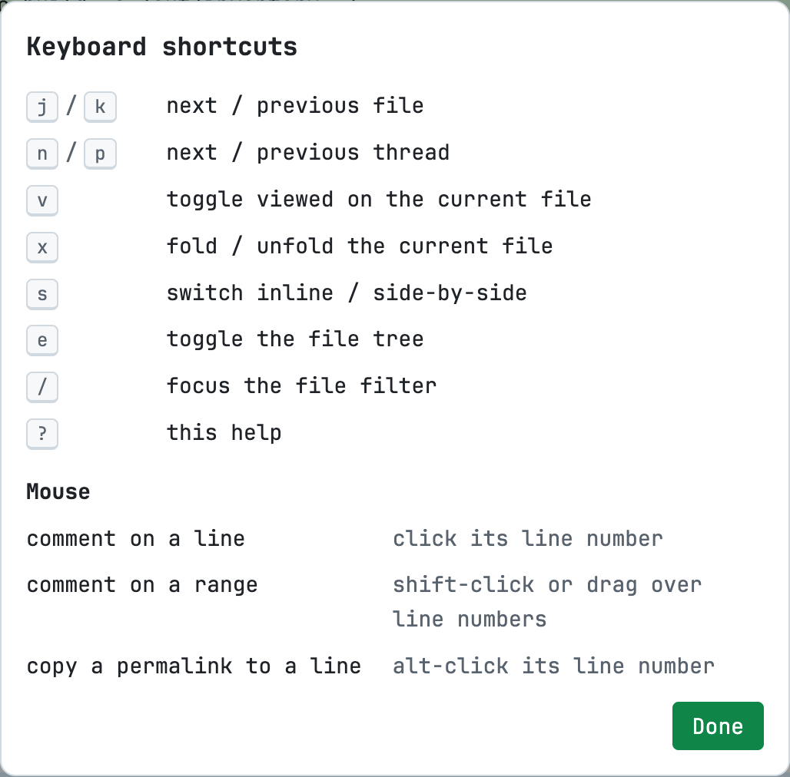
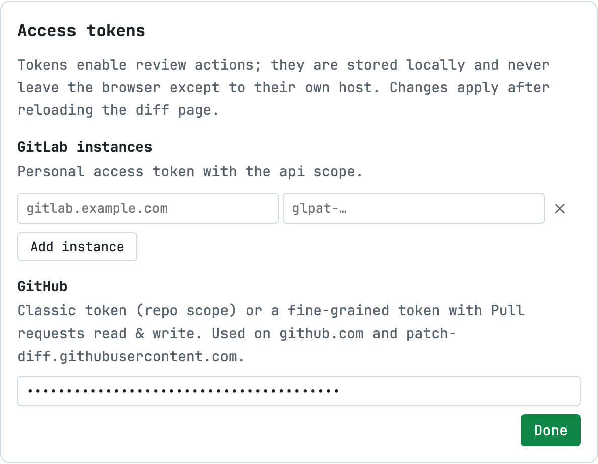

# patchtree

Chrome/Firefox extension that turns raw `.diff` / `.patch` URLs into a
full-featured code review UI — with tree-sitter syntax highlighting and
review workflows for **GitLab** (any instance, including self-hosted) and
**GitHub**.

Open `https://gitlab.example.com/group/project/-/merge_requests/104.diff`
(or click the extension icon on any MR/PR page) and review right there.


## Features

### Diff rendering

- Renders any plain-text `*.diff` / `*.patch` page, whatever served it —
  including **local files** opened via `file://` (git-format or a plain
  `diff -u`; review actions are off since there is no host to talk to).
- **Inline and side-by-side** views; fully added/deleted files take the
  full width in split mode.
- **Word-level diff**: changed words inside modified line pairs get a
  stronger tint (LCS over tokens), layered under syntax colors; can be
  toggled off in settings (suggestion widgets always keep it).
- **Syntax highlighting** with real parsers (web-tree-sitter, wasm, run in
  the background worker): go, js/ts/tsx, python, bash, json, yaml, rust,
  c, c++, java, ruby, php, c#, lua, toml, hcl/terraform, css, html,
  kotlin, scala, dart, groovy, elixir, haskell, zig,
  Dockerfile/Containerfile, and Helm/Go templates (`.tpl`, and any
  `.yaml` containing `{{ … }}` actions).
  Languages without a grammar fall back to highlight.js (swift, sql,
  markdown, makefile, perl, r, …); files without an extension go by
  shebang, then hljs auto-detection.
- **Expand hidden lines** between hunks (fetched from the repository at
  the head revision, highlighted and commentable) or the **Full file**
  toggle per file.
- Large diffs stay fast: only visible file sections are rendered.

### Navigation

- Resizable, filterable **file tree** (filter matches paths *and* diff
  content), folder icons, per-file `+N −M`, comment-count badge.
- **Viewed** checkboxes with a progress counter, fold/unfold,
  auto-collapsed `generated` files (lock files, `*.pb.go`, `vendor/`,
  minified assets).
- **Keyboard**: `j`/`k` files, `n`/`p` threads (centered), `v` viewed,
  `x` fold, `s` inline/side-by-side, `e` file tree, `/` focus filter,
  `?` shortcuts overlay — bound to physical keys, so they work on any
  keyboard layout.
- **Commit filter** — icon until you pick a commit, then a chip with its
  sha and a reset ×; shows the diff of that commit alone.
- Compact toolbar: `+N −M · viewed/total` with a one-click reset, an
  unresolved-threads badge, source → target branch with a copy button,
  pipeline/checks status, and single buttons that fold every file or
  flip inline ⇄ side-by-side (each labelled by what it will do).
- Alt-click a line number → copy a **permalink** to that line's blob.
- Copy-path and open-at-head buttons in every file header.

### Review

- **Threads on lines** (anchored to the old or new side, half-width in
  split view), replies, edit and delete of your comments.
- **Markdown everywhere**: toolbar (heading, bold, italic, code, lists),
  Write/Preview tabs, rendered through the platform's own markdown API.
- **Suggestions**: one click inserts a ```suggestion``` block prefilled
  with the commented line; existing suggestions render as a red/green
  widget with **Apply suggestion** (GitLab).
- **Multiline comments**: shift-click a line number to extend the range.
- **Resolve/unresolve** threads (GitLab) and an **unresolved badge** in
  the toolbar that jumps to each open thread.
- **Draft reviews** (GitLab): “Add to review” collects pending comments,
  published together by Submit review.
- **Submit review** panel: summary comment + Comment / Approve (or
  Unapprove) / Request changes; approval state shown as a badge.
- General (non-diff) MR/PR discussion rendered above the first file.
- Merge-conflict indicator in the toolbar.

### Appearance

- **Theme gallery**: the base24 schemes from
  [tinted-theming](https://github.com/tinted-theming/schemes) (MIT) with live
  code previews — including how added/removed diff lines look — search and a
  light/dark filter, plus paste-your-own scheme yaml.
- Bundled fonts: JetBrains Mono, Inter and Nerd Font Mono builds of
  JetBrainsMono / FiraCode / Hack / MesloLGS / Iosevka; any local font by
  name; separate UI/code font sizes, tab width, italic comments and
  ligatures toggles.

## Install

Binary assets (wasm grammars, fonts, highlight queries, theme data) are
not stored in git — the default make target fetches them from pinned
upstream releases, then bundles the sources into `dist/`:

```sh
git clone https://github.com/danilrwx/patchtree
cd patchtree
make          # fetch pinned assets + npm install + bundle into dist/
```

Then `chrome://extensions` → Developer mode → Load unpacked → the
**`dist/`** directory. To enable review actions, open the ⚙ menu → **Access
tokens** on any diff page and add a GitLab host (PAT scope `api`) and/or
a GitHub token (classic `repo`, or fine-grained with Pull requests
read & write); rendering works without tokens. Tokens are stored in
`storage.local` and never synced.

Make sure the extension's **Site access** is “On all sites” (or grant
your hosts explicitly) — without it the content script is not injected.
To render local `.diff` / `.patch` files (`file://`), also enable
**Allow access to file URLs** in the extension's details page.

## Firefox

`make zip-firefox` builds `patchtree-firefox.zip` with an event-page
background and the gecko id. For development load it via
`about:debugging` → Load Temporary Add-on. Permanent installs come from
the AMO listing: on `v*` tags CI submits the version to the public AMO
channel for review when `AMO_JWT_ISSUER`/`AMO_JWT_SECRET` secrets are
configured. Firefox MV3 treats host permissions as opt-in — enable
“Access your data for all websites” in the add-on's Permissions tab.

## Build / release

- `make` — fetch pinned assets (`vendor`, `queries`, `fonts`, `themes`),
  `npm install`, and bundle the sources into `dist/` with esbuild; asset
  fetches skip when files are already present.
- `make check` — syntax-check the sources.
- `make typecheck` — `tsc --noEmit` over the TypeScript sources.
- `make test` — run the pure-logic checks in `test/run.mjs`.
- `make e2e` — Playwright end-to-end: loads the built extension against a PR
  `.diff` fixture with the adapter mocked (needs `npx playwright install
  chromium`; runs headed, use `xvfb-run` on Linux).
- `make zip` / `make zip-firefox` — bundle and archive `dist/`.
- `node scripts/scenes.mjs` — reshoot the numbered gallery frames (2x into
  `docs/screenshots/`, 1x into `docs/store/` for the store listings);
  `node scripts/screenshots.mjs` — the detail frames.
- `make clean` — remove fetched assets, `dist/`, and archives.

CI (`.github/workflows/release.yml`) rebuilds every asset from the pinned
upstream versions on each push and attaches the archives plus sha256
checksums to the GitHub Release on `v*` tags — nothing binary is taken
from the repository, so artifact contents are fully traceable:

- `web-tree-sitter` + grammar wasm builds — npm packages
  (`scripts/fetch-vendor.sh`).
- Highlight queries — grammar repos at matching tags
  (`scripts/fetch-queries.sh`).
- Fonts — upstream releases, Nerd Font ttf converted to woff2 with the
  ttf2woff2 npm package (`scripts/fetch-fonts.sh`).
- Themes — tinted-theming schemes at a pinned commit
  (`scripts/fetch-themes.sh`).

To release: `git tag v1.2.0 && git push --tags`. CI generates the
release notes from conventional commits (`scripts/changelog.sh`).

## Documentation

- [docs/user-guide.md](docs/user-guide.md) — using the review UI.
- [docs/architecture.md](docs/architecture.md) — how the extension is built.
- [CONTRIBUTING.md](CONTRIBUTING.md) — dev setup and conventions.

## Changelog

See [CHANGELOG.md](CHANGELOG.md). It is grouped from
[conventional commits](https://www.conventionalcommits.org) — preview the
unreleased section with `make changelog RANGE=v1.2.0..HEAD`, or the notes
a tag will carry with `scripts/changelog.sh v1.2.0`.

## Gallery

Review threads: replies, resolve, and suggestions with one-click apply:


Side-by-side view with word-level diff:


Commenting on a range of lines, with a markdown editor:


Theme gallery over a dark scheme — base24 schemes with live diff previews:


Toolbar — commit filter, unresolved badge, source → target branch, diffstat,
viewed progress and the layout toggles:


File tree with filter, per-file stats and comment badges:



Commit filter — the diff of a single commit:



Unresolved badge — the dropdown jumps to each open thread:



Settings menu — fonts, sizes, view options, shortcuts and tokens:



Keyboard shortcuts overlay (`?`):



Access tokens setup:



## License

Apache License 2.0 (see [LICENSE](LICENSE) and [NOTICE](NOTICE)) — copies must
retain the copyright and license notices. Bundled third-party assets keep their own licenses: web-tree-sitter and
the grammars (MIT), highlight.js (BSD-3-Clause), JetBrains Mono / Inter
(OFL), Nerd Fonts patched fonts (MIT + upstream font licenses),
tinted-theming schemes (MIT).
