# patchtree

[](https://github.com/danilrwx/patchtree/actions/workflows/release.yml)


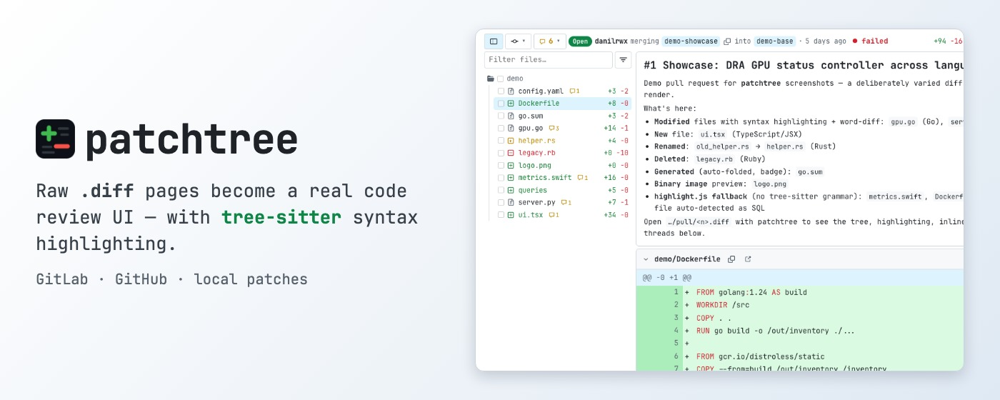

Chrome/Firefox extension that turns raw `.diff` / `.patch` URLs into a
full-featured code review UI, with **real tree-sitter syntax highlighting**
— the same grammars Neovim, Helix and Zed parse with, not regex guesswork —
and review workflows for **GitLab** (any instance, including self-hosted)
and **GitHub**.

Open `https://gitlab.example.com/group/project/-/merge_requests/104.diff`
(or click the extension icon on any MR/PR page) and review right there.

## Features

### Syntax highlighting that actually parses the code

Diff viewers usually colour patches with regular expressions, so a template
string, a nested generic or a heredoc quietly falls apart. patchtree runs the
**real grammars** instead — the same tree-sitter parsers editors like Neovim,
Helix and Zed use — compiled to WebAssembly and executed in the extension's
background worker.

- **A real parse tree per file**, so nesting is never guessed: JSX inside
  TypeScript, generics, Rust macros, bash heredocs, f-strings, and Helm/Go
  template actions embedded in YAML all keep their structure.
- **30 grammars**, each pinned to the revision its highlight queries were
  written for: go, js/ts/tsx, python, bash, json, yaml, rust, c, c++, java,
  ruby, php, c#, lua, toml, hcl/terraform, css, html, kotlin, scala, dart,
  groovy, elixir, haskell, zig, markdown, Dockerfile/Containerfile, and
  Helm/Go templates (`.tpl`, and any `.yaml` carrying `{{ … }}` actions).
- **Language injection**, the way editors do it: a ` ```go ` block inside a
  markdown file is parsed *as Go*, prose runs through the inline grammar, and
  Helm actions layer over the yaml underneath — one file, several grammars.
- **Off the main thread**: wasm grammars load lazily, one per language a diff
  actually contains, and parsing happens in the background worker — a
  10 000-line diff never blocks scrolling.
- **Layered with the diff itself**: word-level diff tints sit under the syntax
  colours, so you see both what changed and what it means.
- Anything without a grammar falls back to highlight.js (swift, sql, makefile,
  perl, r, protobuf, objective-c, ocaml, erlang, clojure, …); files with no
  extension go by shebang, then auto-detection.
- Every colour comes from the active theme, so highlighting follows the
  base24 scheme you pick (see Appearance).

### Diff rendering

- Renders any plain-text `*.diff` / `*.patch` page, whatever served it —
  including **local files** opened via `file://` (git-format or a plain
  `diff -u`; review actions are off since there is no host to talk to).
- **The change explains itself first**: a merge/pull request shows its title and
  description (through the platform's markdown API, long ones collapsed, and it
  can be switched off in settings), and a `git format-patch` file shows its
  commit message with mail headers, diffstat and clickable links highlighted.
- **Inline and side-by-side** views; fully added/deleted files take the
  full width in split mode.
- **Word-level diff**: changed words inside modified line pairs get a
  stronger tint (LCS over tokens), layered under syntax colors; can be
  toggled off in settings (suggestion widgets always keep it).
- **Expand hidden lines** between hunks (fetched from the repository at
  the head revision, highlighted and commentable) or the **Full file**
  toggle per file.
- Large diffs stay fast: only visible file sections are rendered.

### Navigation

- Resizable, filterable **file tree** (filter matches paths *and* diff
  content), folder icons, per-file `+N −M`, comment-count badge.
- **Viewed** checkboxes with a progress counter, fold/unfold,
  auto-collapsed `generated` files (lock files, `*.pb.go`, `vendor/`,
  minified assets). The tree carries them too — per file, or per folder to
  cover everything under it; a folder folds itself once it is fully read, and
  comes back folded after a reload.
- **Keyboard**: `j`/`k` files, `n`/`p` threads (centered), `v` viewed,
  `x` fold, `s` inline/side-by-side, `e` file tree, `/` focus filter,
  `?` shortcuts overlay — bound to physical keys, so they work on any
  keyboard layout.
- **Request summary in the toolbar**: a state chip (Open / Draft / Merged /
  Closed) followed by who is merging which branch into which, and when — the
  same line the platforms show under the request title, with a copy button on
  the source branch.
- **The way back**: that state chip links to the request, and the extension icon
  works both ways — from a merge/pull request it opens the diff, from a diff it
  returns to the request (re-activating the tab you came from rather than
  opening another one).
- **Commit picker** — icon until you pick a commit, then a chip with its sha and
  a reset ×; shows the diff of that commit alone. Rows carry the subject, author
  and date, copy the full sha, or open the commit on the host, and a filter
  field appears on long branches (sha, message or author; Enter takes the first
  match).
- Compact toolbar: `+N −M · viewed/total` with a one-click reset, an
  unresolved-threads badge, and single buttons that fold every file or
  flip inline ⇄ side-by-side (each labelled by what it will do).
- **Pipeline status that opens up**: the badge lists the jobs behind it — name,
  stage, state, one click to the job's log — and **Approve carries a warning
  while the pipeline is red**, so a broken build is hard to approve by accident.
- Alt-click a line number → copy a **permalink** to that line's blob.
- Copy-path and open-at-head buttons in every file header.

### Review

- **Threads on lines** (anchored to the old or new side, half-width in
  split view), replies, edit and delete of your comments.
- **Markdown everywhere**: toolbar (heading, bold, italic, code, lists),
  Write/Preview tabs, rendered through the platform's own markdown API.
- **Suggestions**: one click inserts a ```suggestion``` block prefilled
  with the commented line; existing suggestions render as a red/green
  widget with **Apply suggestion** (GitLab).
- **Multiline comments**: shift-click a line number to extend the range.
- **Resolve/unresolve** threads (GitLab) and an **unresolved badge** in the
  toolbar listing every open one — location, first comment, author, age and
  reply count, in the diff's own file order — to jump to it, or resolve it
  without leaving the bar. Long lists get a filter (file, author or text).
- **Draft reviews** (GitLab): “Add to review” collects pending comments,
  published together by Submit review.
- **Submit review** panel: summary comment + Comment / Approve (or
  Unapprove) / Request changes; approval state shown as a badge.
- General (non-diff) MR/PR discussion rendered above the first file.
- Merge-conflict indicator in the toolbar.

### Appearance

- **Theme gallery**: the base24 schemes from
  [tinted-theming](https://github.com/tinted-theming/schemes) (MIT) with live
  code previews — including how added/removed diff lines look — search and a
  light/dark filter, plus paste-your-own scheme yaml.
- Bundled fonts: JetBrains Mono, Inter and Nerd Font Mono builds of
  JetBrainsMono / FiraCode / Hack / MesloLGS / Iosevka; any local font by
  name; separate UI/code font sizes, tab width, italic comments and
  ligatures toggles.

## Install

Binary assets (wasm grammars, fonts, highlight queries, theme data) are
not stored in git — the default make target fetches them from pinned
upstream releases, then bundles the sources into `dist/`:

```sh
git clone https://github.com/danilrwx/patchtree
cd patchtree
make          # fetch pinned assets + npm install + bundle into dist/
```

Then `chrome://extensions` → Developer mode → Load unpacked → the
**`dist/`** directory. To enable review actions, open the ⚙ menu → **Access
tokens** on any diff page and add a GitLab host (PAT scope `api`) and/or
a GitHub token (classic `repo`, or fine-grained with Pull requests
read & write); rendering works without tokens. Tokens are stored in
`storage.local` and never synced.

Make sure the extension's **Site access** is “On all sites” (or grant
your hosts explicitly) — without it the content script is not injected.
To render local `.diff` / `.patch` files (`file://`), also enable
**Allow access to file URLs** in the extension's details page.

## Firefox

`make zip-firefox` builds `patchtree-firefox.zip` with an event-page
background and the gecko id. For development load it via
`about:debugging` → Load Temporary Add-on. Permanent installs come from
the AMO listing: on `v*` tags CI submits the version to the public AMO
channel for review when `AMO_JWT_ISSUER`/`AMO_JWT_SECRET` secrets are
configured. Firefox MV3 treats host permissions as opt-in — enable
“Access your data for all websites” in the add-on's Permissions tab.

## Build / release

- `make` — fetch pinned assets (`vendor`, `queries`, `fonts`, `themes`),
  `npm install`, and bundle the sources into `dist/` with esbuild; asset
  fetches skip when files are already present.
- `make check` — syntax-check the sources.
- `make typecheck` — `tsc --noEmit` over the TypeScript sources.
- `make test` — run the pure-logic checks in `test/run.mjs`.
- `make e2e` — Playwright end-to-end: loads the built extension against a PR
  `.diff` fixture with the adapter mocked (needs `npx playwright install
  chromium`). Runs in Chromium's new headless mode, which loads MV3
  extensions, so no window appears and no display is required;
  `PT_HEADED=1 make e2e` shows the browser when you need to watch it.
- `make zip` / `make zip-firefox` — bundle and archive `dist/`.
- `node scripts/scenes.mjs` — reshoot every gallery frame: 2x into
  `docs/screenshots/` for this README, and the first five at 1x into
  `docs/store/` for the Chrome Web Store and AMO listings.
- `node scripts/promo.mjs` — render the store promo images (440x280 tile and
  1400x560 marquee). Listing copy lives in
  [docs/store/LISTING.txt](docs/store/LISTING.txt) — plain text, since the
  Chrome Web Store renders neither markdown nor html.
- `make clean` — remove fetched assets, `dist/`, and archives.

CI (`.github/workflows/release.yml`) rebuilds every asset from the pinned
upstream versions on each push and attaches the archives plus sha256
checksums to the GitHub Release on `v*` tags — nothing binary is taken
from the repository, so artifact contents are fully traceable:

- `web-tree-sitter` + grammar wasm builds — npm packages
  (`scripts/fetch-vendor.sh`).
- Highlight queries — grammar repos at matching tags
  (`scripts/fetch-queries.sh`).
- Fonts — upstream releases, Nerd Font ttf converted to woff2 with the
  ttf2woff2 npm package (`scripts/fetch-fonts.sh`).
- Themes — tinted-theming schemes at a pinned commit
  (`scripts/fetch-themes.sh`).

To release: `git tag v1.3.0 && git push --tags`. CI generates the
release notes from conventional commits (`scripts/changelog.sh`).

## Documentation

- [PRIVACY.md](PRIVACY.md) — what is stored locally and where requests go.
- [docs/user-guide.md](docs/user-guide.md) — using the review UI.
- [docs/architecture.md](docs/architecture.md) — how the extension is built.
- [CONTRIBUTING.md](CONTRIBUTING.md) — dev setup and conventions.

## Changelog

See [CHANGELOG.md](CHANGELOG.md). It is grouped from
[conventional commits](https://www.conventionalcommits.org) — preview the
unreleased section with `make changelog RANGE=v1.3.0..HEAD`, or the notes
a tag will carry with `scripts/changelog.sh v1.3.0`.

## Gallery

The full window: file tree, compact toolbar, parsed and highlighted diff:

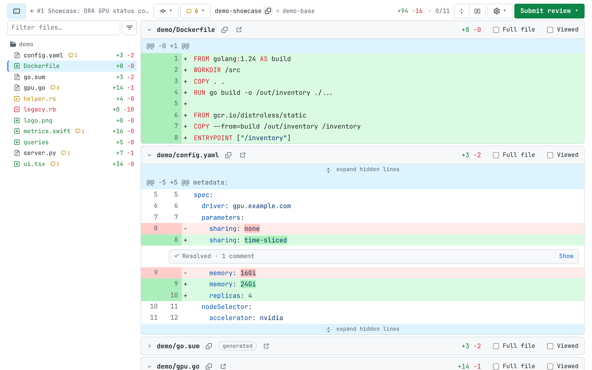

Review threads: replies, resolve, and suggestions with one-click apply:

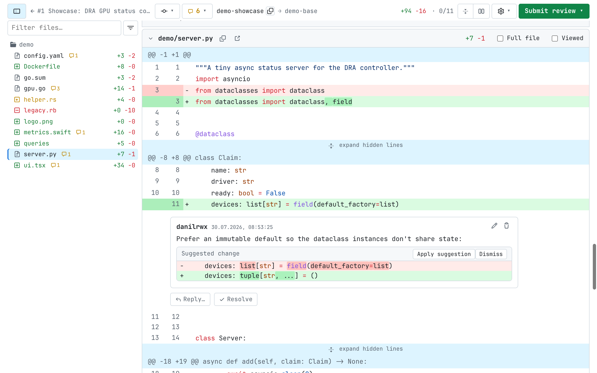

Side-by-side view with word-level diff:

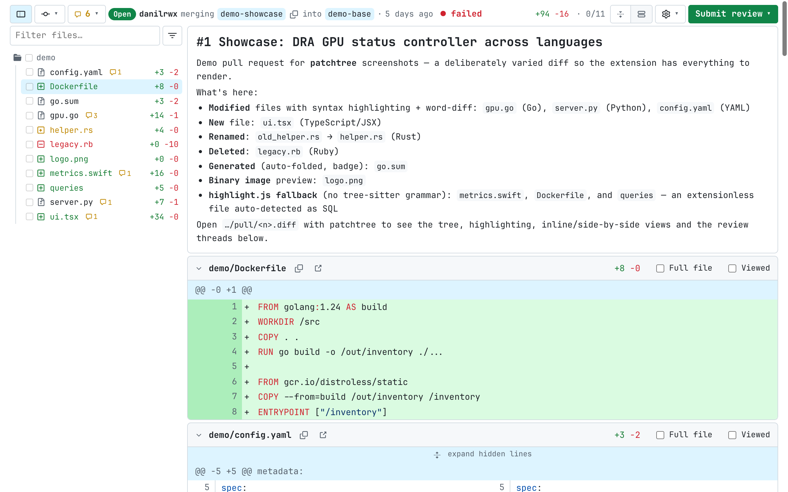

Commenting on a range of lines, with a markdown editor:

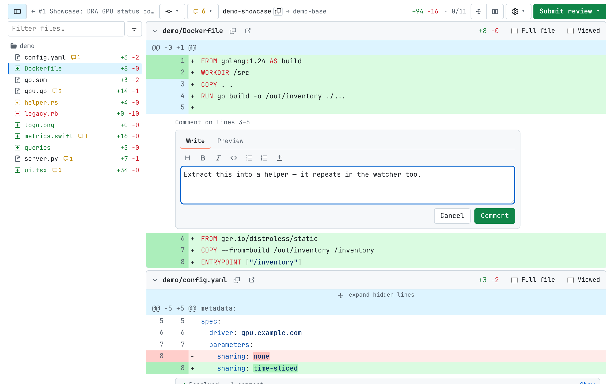

Theme gallery over a dark scheme — base24 schemes with live diff previews:

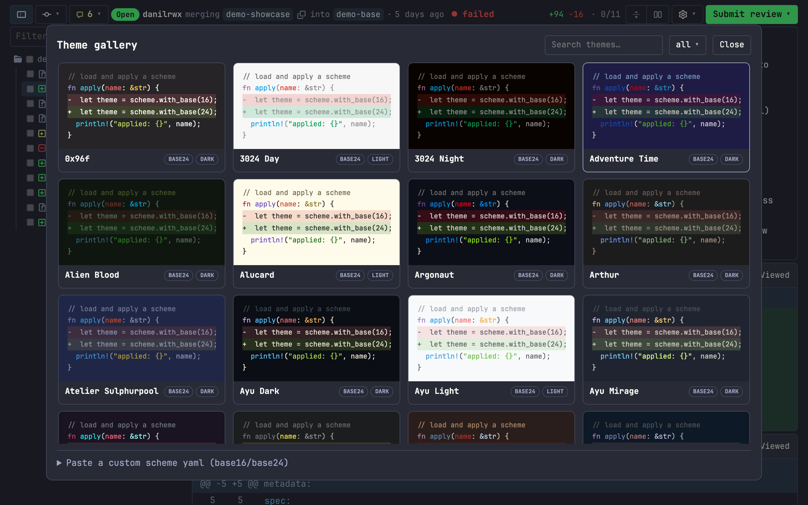

Settings: theme, fonts, sizes and view options:

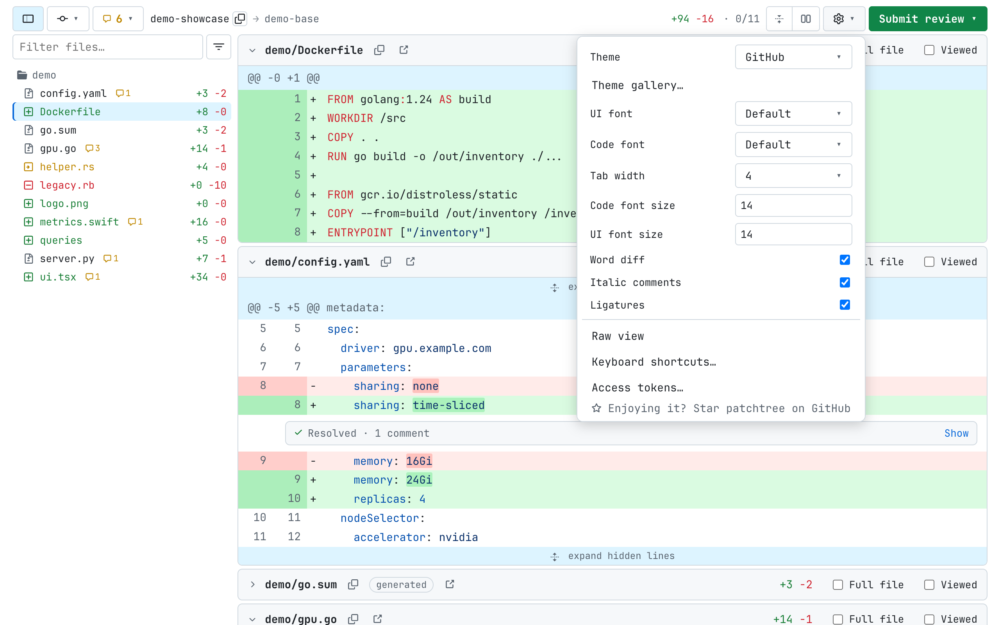

Keyboard shortcuts overlay (`?`):

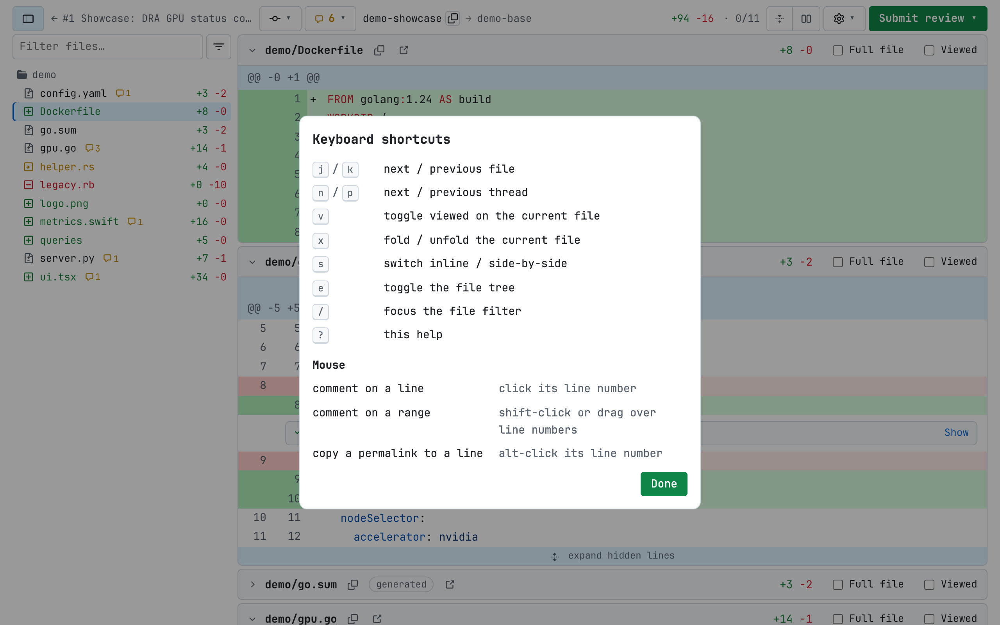

The unresolved badge lists every open thread — where it sits, who opened it and
how long ago, with a resolve button right in the row:

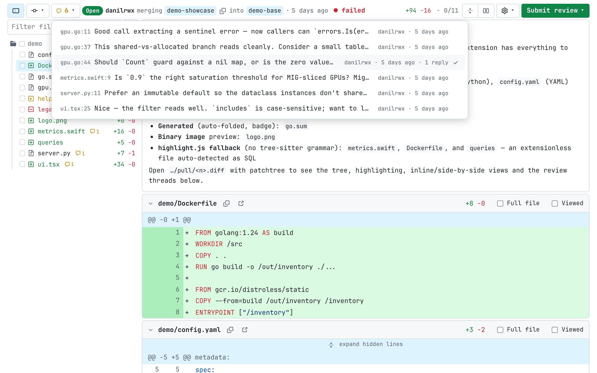

Commit picker — review a single commit's diff; each row carries its author and
date, copies the full sha, or opens the commit on the host:

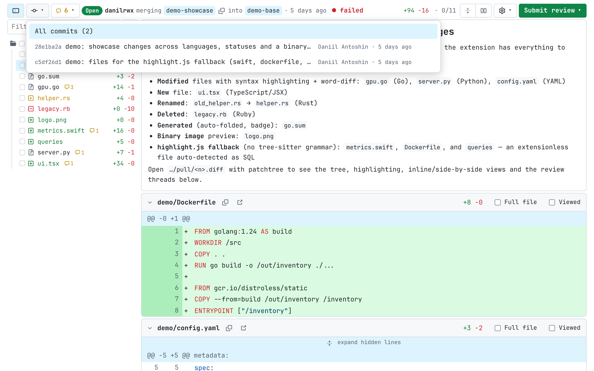

Tree filter — by extension, or hide viewed and deleted files:

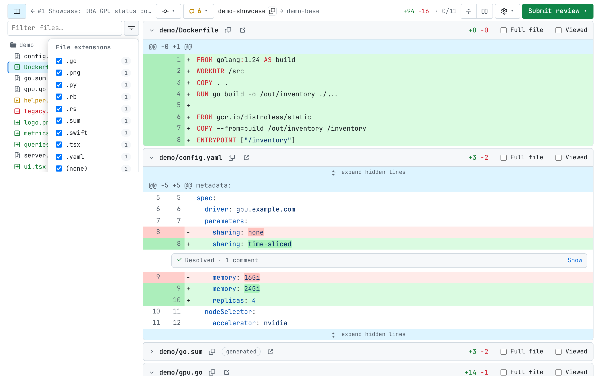

Access tokens, stored locally and never synced:

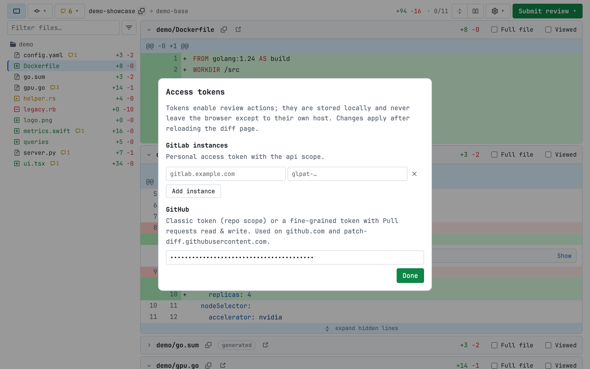

Pipeline status in the bar, with the jobs behind it:

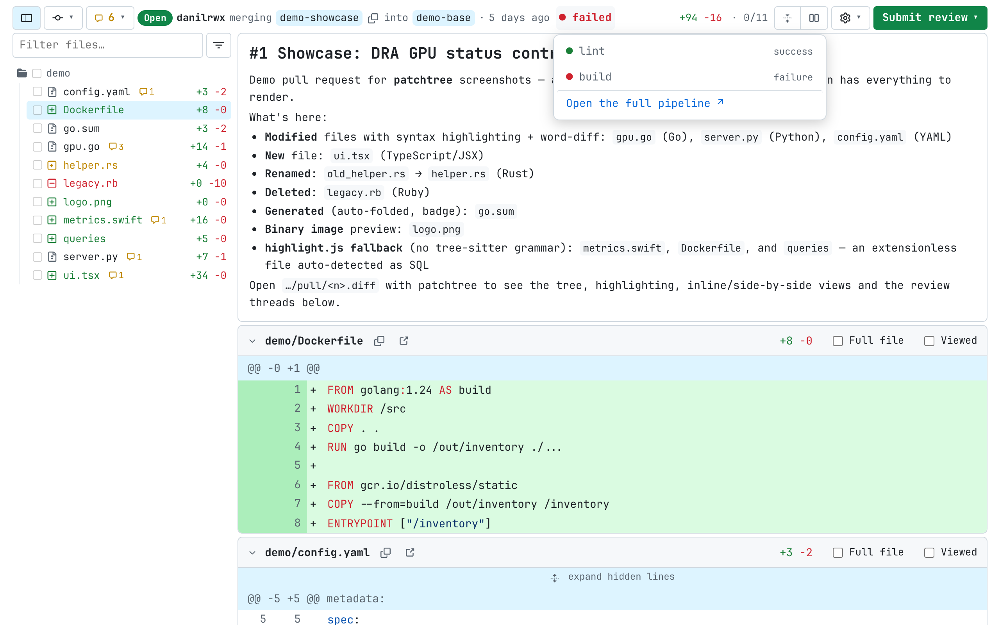

Submitting a review — approving a failing pipeline is called out, not blocked:

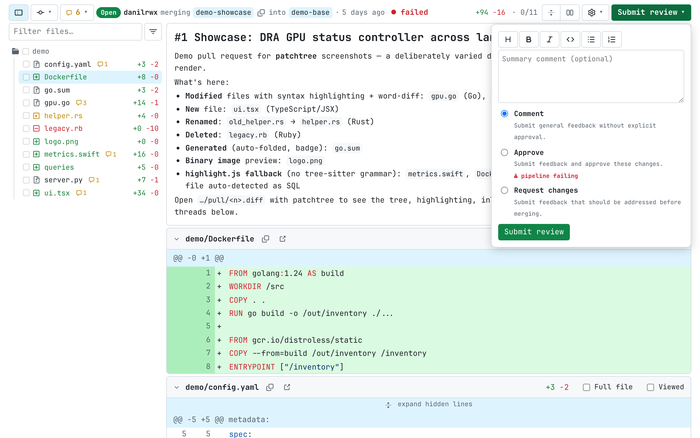

Reading progress in the tree: mark a file or a whole folder viewed, and a
finished folder folds itself away:

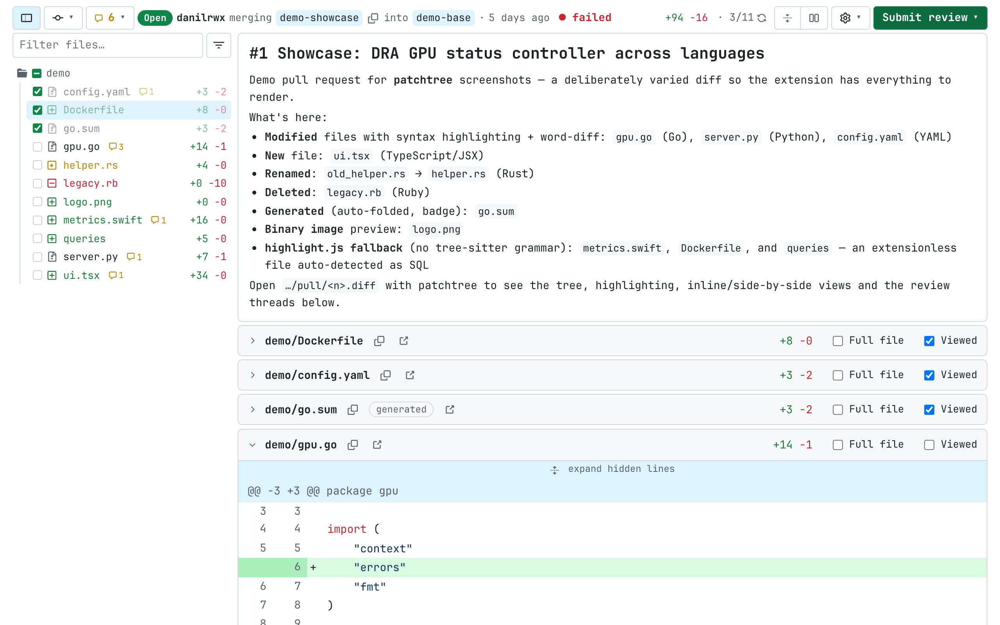

## License

Apache License 2.0 (see [LICENSE](LICENSE) and [NOTICE](NOTICE)) — copies must
retain the copyright and license notices. Bundled third-party assets keep their own licenses: web-tree-sitter and
the grammars (MIT), highlight.js (BSD-3-Clause), JetBrains Mono / Inter
(OFL), Nerd Fonts patched fonts (MIT + upstream font licenses),
tinted-theming schemes (MIT).
