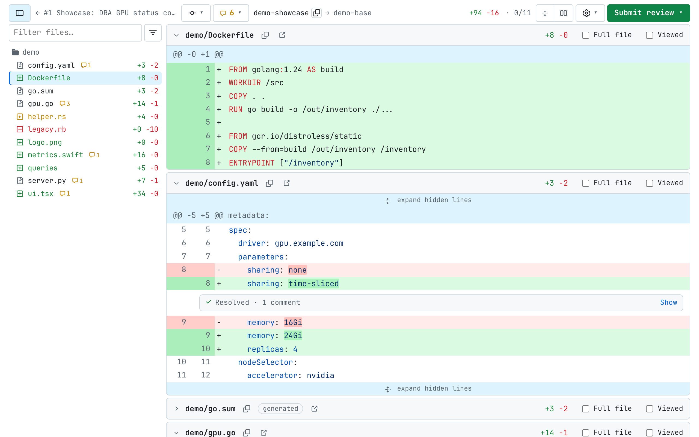
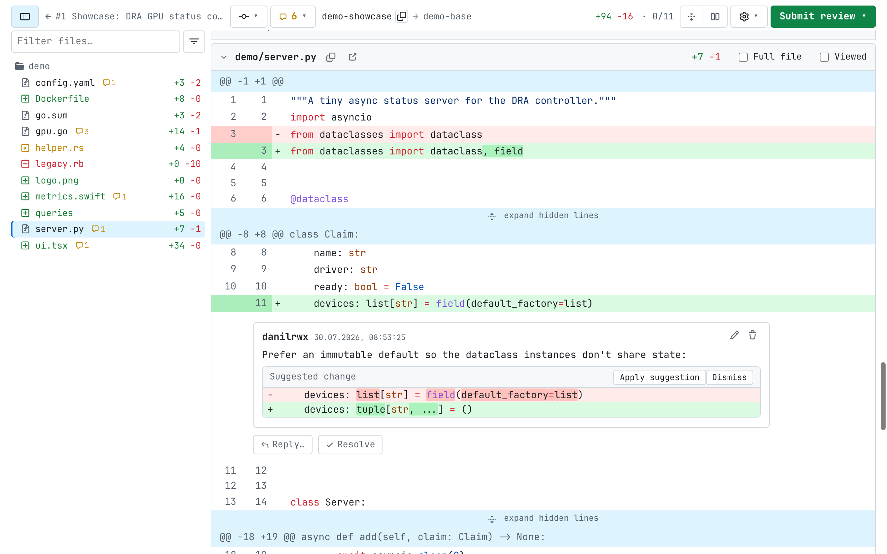
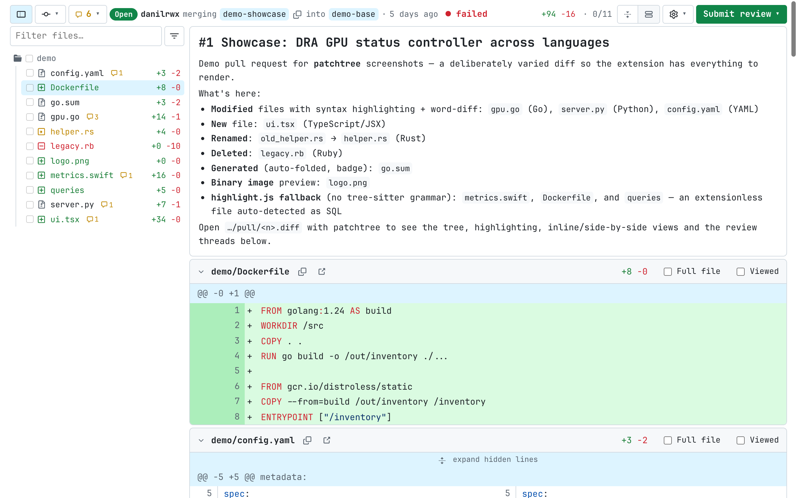
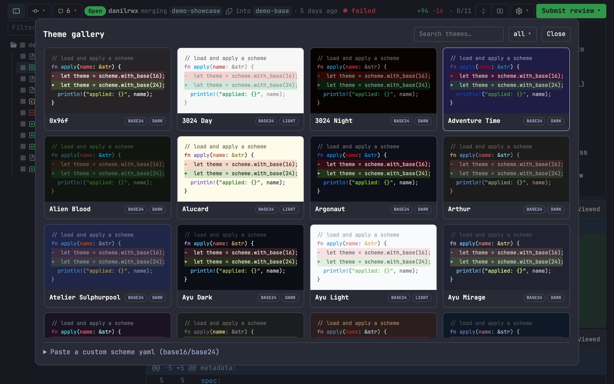

# patchtree

**Code review that feels like your editor — right in the browser.**
Open any merge request or pull request as a `.diff`, and patchtree turns it into
a fast review UI with real tree-sitter highlighting, a file tree, inline
threads, suggestions and approvals. For **GitLab** (self-hosted too) and
**GitHub**.

&nbsp;&nbsp;

## Try it in 10 seconds

1. Install from the store above.
2. Open any PR or MR and add `.diff` to the URL — or just click the extension
   icon on the page:
   `https://github.com/owner/repo/pull/123.diff`
3. Review.

Reading works right away, no setup. Want to comment and approve? Add a token
once in ⚙ → **Access tokens**.

## Why patchtree

- **Highlighting that actually parses the code.** The same tree-sitter grammars
  Neovim, Helix and Zed use — 30 languages, JSX in TypeScript, Helm templates in
  YAML, Go blocks in Markdown. No regex guesswork.
- **Big diffs stay fast.** Parsing runs off the main thread and only visible
  files render — a 10 000-line diff scrolls like a small one.
- **Keyboard-first.** `j`/`k` between files, `n`/`p` between threads, `v` to mark
  viewed, `?` for the rest. Works on any keyboard layout.
- **The whole review, one page.** Threads, multiline comments, suggestions with
  one-click apply, resolve, draft reviews, approve / request changes, pipeline
  status, all on the diff page.
- **Your colours, your font.** Nearly 200 base24 themes with live previews,
  bundled Nerd Fonts, ligatures.
- **Private by design.** No server, no account, no telemetry. Tokens stay in
  your browser and only talk to your own GitLab/GitHub. See
  [PRIVACY.md](PRIVACY.md).

## Install

&nbsp;&nbsp;

That's it for reading diffs. Two optional extras:

- **Review actions** — on any diff page open ⚙ → **Access tokens** and add a
  GitLab host (PAT scope `api`) and/or a GitHub token (classic `repo`, or
  fine-grained with Pull requests read & write). Tokens live in
  `storage.local` and are never synced.
- **Local files** — to render `.diff` / `.patch` opened via `file://`, enable
  **Allow access to file URLs** in the extension's details page.

Nothing shows up? Check that the extension's **Site access** is “On all sites”
(or grant your hosts explicitly). On Firefox, enable “Access your data for all
websites” in the add-on's Permissions tab.

Prefer to build it yourself? See [CONTRIBUTING.md](CONTRIBUTING.md#build-from-source).

## Languages

Real tree-sitter grammars for go, js/ts/tsx, python, bash, json, yaml, rust, c,
c++, java, ruby, php, c#, lua, toml, hcl/terraform, css, html, kotlin, scala,
dart, groovy, elixir, haskell, zig, markdown, Dockerfile and Helm/Go templates;
everything else falls back to highlight.js.

**Want the details?** [docs/features.md](docs/features.md) has the full feature
list and every screenshot.

## Documentation

- [docs/user-guide.md](docs/user-guide.md) — using the review UI.
- [docs/features.md](docs/features.md) — the full feature list and gallery.
- [PRIVACY.md](PRIVACY.md) — what is stored locally and where requests go.
- [CHANGELOG.md](CHANGELOG.md) — what changed in each release.
- [CONTRIBUTING.md](CONTRIBUTING.md) — building from source, dev setup and conventions.
- [docs/architecture.md](docs/architecture.md) — how the extension is built.

## License

Apache License 2.0 (see [LICENSE](LICENSE) and [NOTICE](NOTICE)) — copies must
retain the copyright and license notices. Bundled third-party assets keep their own licenses: web-tree-sitter and
the grammars (MIT), highlight.js (BSD-3-Clause), Nerd Fonts patched
fonts (MIT + upstream font licenses, JetBrains Mono is OFL),
tinted-theming schemes (MIT).
