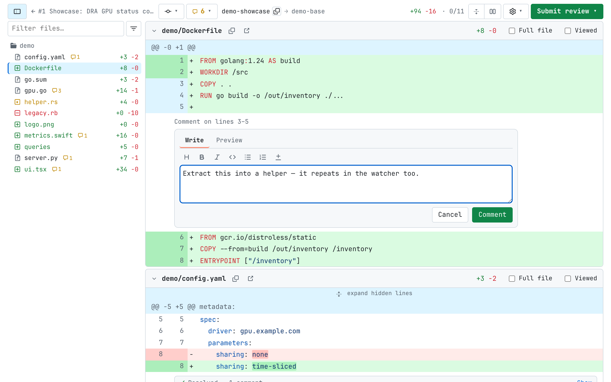
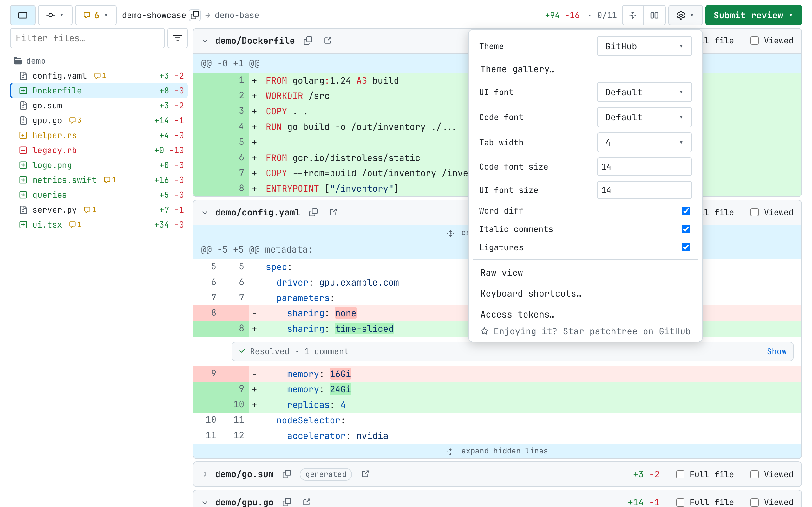
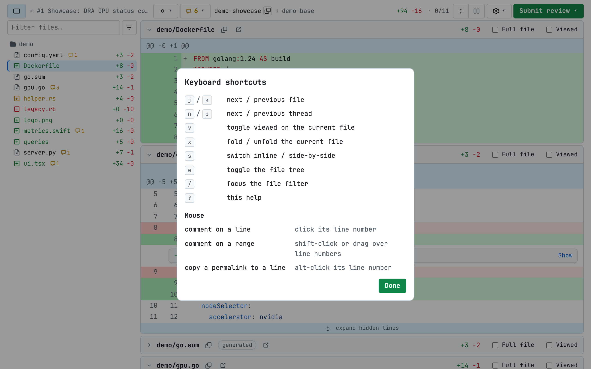
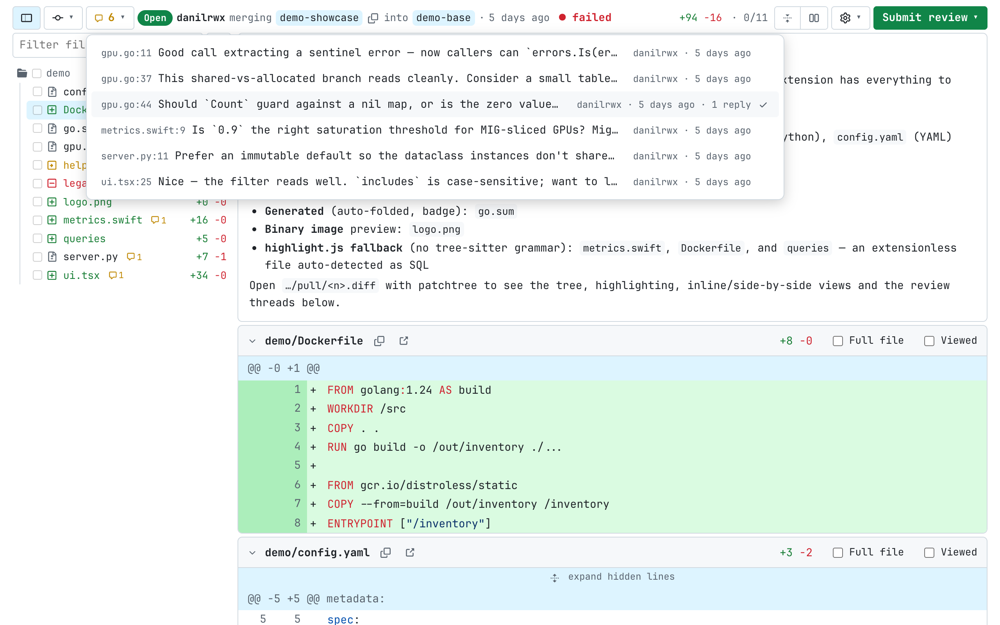
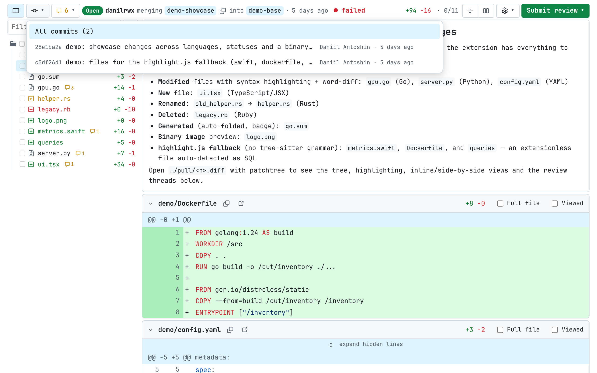
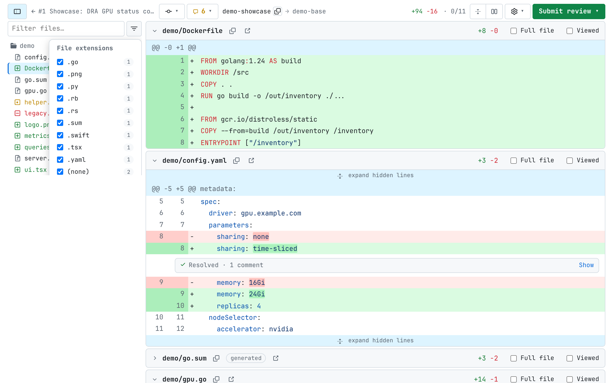
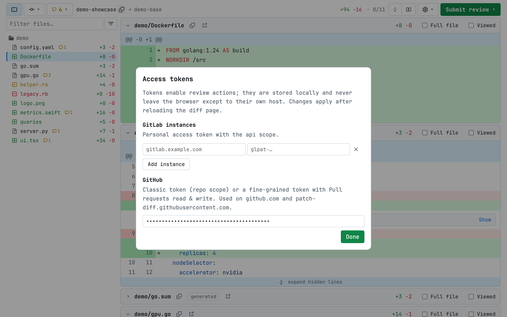
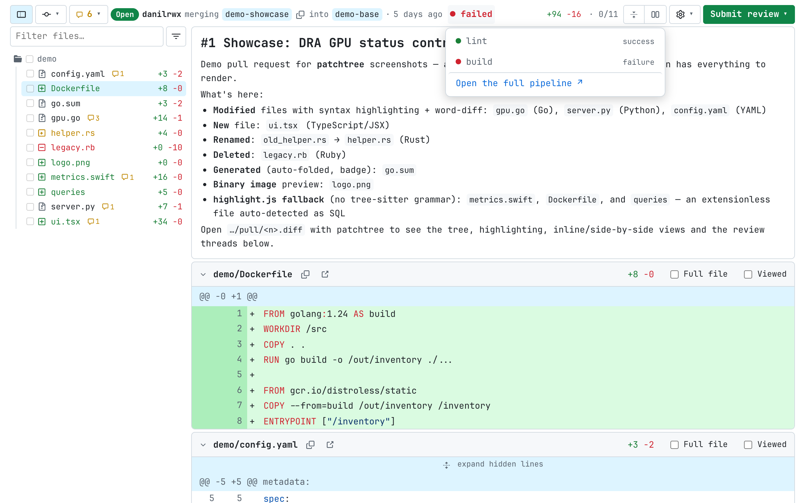
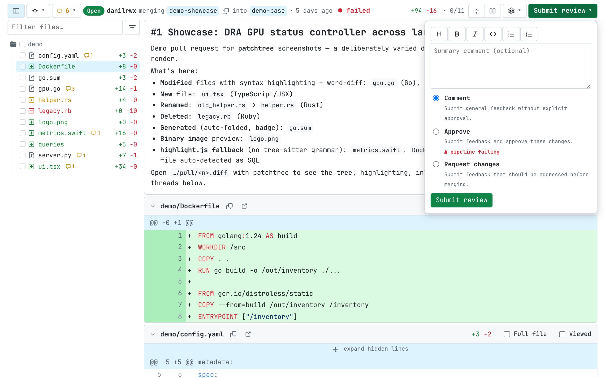
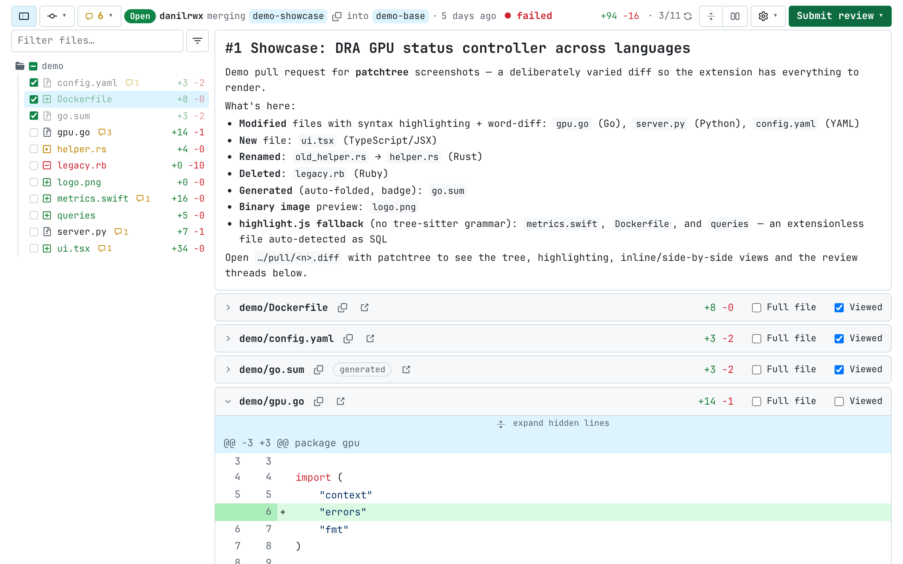

# patchtree

[](https://github.com/danilrwx/patchtree/actions/workflows/release.yml)

[](https://chromewebstore.google.com/detail/patchtree/dgpflholobnbgomakjbkdmcnfccdjone)
[](https://addons.mozilla.org/en-US/firefox/addon/patchtree/)

**Code review that feels like your editor — right in the browser.**
Open any merge request or pull request as a `.diff`, and patchtree turns it into
a fast review UI with real tree-sitter highlighting, a file tree, inline
threads, suggestions and approvals. For **GitLab** (self-hosted too) and
**GitHub**.

[](https://chromewebstore.google.com/detail/patchtree/dgpflholobnbgomakjbkdmcnfccdjone)&nbsp;&nbsp;[](https://addons.mozilla.org/en-US/firefox/addon/patchtree/)


## Try it in 10 seconds

1. Install from the store above.
2. Open any PR or MR and add `.diff` to the URL — or just click the extension
   icon on the page:
   `https://github.com/owner/repo/pull/123.diff`
3. Review.

Reading works right away, no setup. Want to comment and approve? Add a token
once in ⚙ → **Access tokens**.

## Why patchtree

- **Highlighting that actually parses the code.** The same tree-sitter grammars
  Neovim, Helix and Zed use — 30 languages, JSX in TypeScript, Helm templates in
  YAML, Go blocks in Markdown. No regex guesswork.
- **Big diffs stay fast.** Parsing runs off the main thread and only visible
  files render — a 10 000-line diff scrolls like a small one.
- **Keyboard-first.** `j`/`k` between files, `n`/`p` between threads, `v` to mark
  viewed, `?` for the rest. Works on any keyboard layout.
- **The whole review, one page.** Threads, multiline comments, suggestions with
  one-click apply, resolve, draft reviews, approve / request changes, pipeline
  status, all on the diff page.
- **Your colours, your font.** Nearly 200 base24 themes with live previews,
  bundled Nerd Fonts, ligatures.
- **Private by design.** No server, no account, no telemetry. Tokens stay in
  your browser and only talk to your own GitLab/GitHub. See
  [PRIVACY.md](PRIVACY.md).


## Install

[](https://chromewebstore.google.com/detail/patchtree/dgpflholobnbgomakjbkdmcnfccdjone)&nbsp;&nbsp;[](https://addons.mozilla.org/en-US/firefox/addon/patchtree/)

That's it for reading diffs. Two optional extras:

- **Review actions** — on any diff page open ⚙ → **Access tokens** and add a
  GitLab host (PAT scope `api`) and/or a GitHub token (classic `repo`, or
  fine-grained with Pull requests read & write). Tokens live in
  `storage.local` and are never synced.
- **Local files** — to render `.diff` / `.patch` opened via `file://`, enable
  **Allow access to file URLs** in the extension's details page.

Nothing shows up? Check that the extension's **Site access** is “On all sites”
(or grant your hosts explicitly). On Firefox, enable “Access your data for all
websites” in the add-on's Permissions tab.

Prefer to build it yourself? See [CONTRIBUTING.md](CONTRIBUTING.md#build-from-source).

## Everything it does

<details>
<summary>Full feature list</summary>

### Syntax highlighting that actually parses the code

Diff viewers usually colour patches with regular expressions, so a template
string, a nested generic or a heredoc quietly falls apart. patchtree runs the
**real grammars** instead — the same tree-sitter parsers editors like Neovim,
Helix and Zed use — compiled to WebAssembly and executed in the extension's
background worker.

- **A real parse tree per file**, so nesting is never guessed: JSX inside
  TypeScript, generics, Rust macros, bash heredocs, f-strings, and Helm/Go
  template actions embedded in YAML all keep their structure.
- **30 grammars**, each pinned to the revision its highlight queries were
  written for: go, js/ts/tsx, python, bash, json, yaml, rust, c, c++, java,
  ruby, php, c#, lua, toml, hcl/terraform, css, html, kotlin, scala, dart,
  groovy, elixir, haskell, zig, markdown, Dockerfile/Containerfile, and
  Helm/Go templates (`.tpl`, and any `.yaml` carrying `{{ … }}` actions).
- **Language injection**, the way editors do it: a ` ```go ` block inside a
  markdown file is parsed *as Go*, prose runs through the inline grammar, and
  Helm actions layer over the yaml underneath — one file, several grammars.
- **Off the main thread**: wasm grammars load lazily, one per language a diff
  actually contains, and parsing happens in the background worker — a
  10 000-line diff never blocks scrolling.
- **Layered with the diff itself**: word-level diff tints sit under the syntax
  colours, so you see both what changed and what it means.
- Anything without a grammar falls back to highlight.js (swift, sql, makefile,
  perl, r, protobuf, objective-c, ocaml, erlang, clojure, …); files with no
  extension go by shebang, then auto-detection.
- Every colour comes from the active theme, so highlighting follows the
  base24 scheme you pick (see Appearance).

### Diff rendering

- Renders any plain-text `*.diff` / `*.patch` page, whatever served it —
  including **local files** opened via `file://` (git-format or a plain
  `diff -u`; review actions are off since there is no host to talk to).
- **The change explains itself first**: a merge/pull request shows its title and
  description (through the platform's markdown API, long ones collapsed, and it
  can be switched off in settings), and a `git format-patch` file shows its
  commit message with mail headers, diffstat and clickable links highlighted.
- **Inline and side-by-side** views; fully added/deleted files take the
  full width in split mode.
- **Word-level diff**: changed words inside modified line pairs get a
  stronger tint (LCS over tokens), layered under syntax colors; can be
  toggled off in settings (suggestion widgets always keep it).
- **Expand hidden lines** between hunks (fetched from the repository at
  the head revision, highlighted and commentable) or the **Full file**
  toggle per file.
- Large diffs stay fast: only visible file sections are rendered.

### Navigation

- Resizable, filterable **file tree** (filter matches paths *and* diff
  content), folder icons, per-file `+N −M`, comment-count badge.
- **Viewed** checkboxes with a progress counter, fold/unfold,
  auto-collapsed `generated` files (lock files, `*.pb.go`, `vendor/`,
  minified assets). The tree carries them too — per file, or per folder to
  cover everything under it; a folder folds itself once it is fully read, and
  comes back folded after a reload.
- **Keyboard**: `j`/`k` files, `n`/`p` threads (centered), `v` viewed,
  `x` fold, `s` inline/side-by-side, `e` file tree, `/` focus filter,
  `?` shortcuts overlay — bound to physical keys, so they work on any
  keyboard layout.
- **Request summary in the toolbar**: a state chip (Open / Draft / Merged /
  Closed) followed by who is merging which branch into which, and when — the
  same line the platforms show under the request title, with a copy button on
  the source branch.
- **The way back**: that state chip links to the request, and the extension icon
  works both ways — from a merge/pull request it opens the diff, from a diff it
  returns to the request (re-activating the tab you came from rather than
  opening another one).
- **Commit picker** — icon until you pick a commit, then a chip with its sha and
  a reset ×; shows the diff of that commit alone. Rows carry the subject, author
  and date, copy the full sha, or open the commit on the host, and a filter
  field appears on long branches (sha, message or author; Enter takes the first
  match).
- Compact toolbar: `+N −M · viewed/total` with a one-click reset, an
  unresolved-threads badge, and single buttons that fold every file or
  flip inline ⇄ side-by-side (each labelled by what it will do).
- **Pipeline status that opens up**: the badge lists the jobs behind it — name,
  stage, state, one click to the job's log — and **Approve carries a warning
  while the pipeline is red**, so a broken build is hard to approve by accident.
- Alt-click a line number → copy a **permalink** to that line's blob.
- Copy-path and open-at-head buttons in every file header.

### Review

- **Threads on lines** (anchored to the old or new side, half-width in
  split view), replies, edit and delete of your comments.
- **Markdown everywhere**: toolbar (heading, bold, italic, code, lists),
  Write/Preview tabs, rendered through the platform's own markdown API.
- **Suggestions**: one click inserts a ```suggestion``` block prefilled
  with the commented line; existing suggestions render as a red/green
  widget with **Apply suggestion** (GitLab).
- **Multiline comments**: shift-click a line number to extend the range.
- **Resolve/unresolve** threads (GitLab) and an **unresolved badge** in the
  toolbar listing every open one — location, first comment, author, age and
  reply count, in the diff's own file order — to jump to it, or resolve it
  without leaving the bar. Long lists get a filter (file, author or text).
- **Draft reviews** (GitLab): “Add to review” collects pending comments,
  published together by Submit review.
- **Submit review** panel: summary comment + Comment / Approve (or
  Unapprove) / Request changes; approval state shown as a badge.
- General (non-diff) MR/PR discussion rendered above the first file.
- Merge-conflict indicator in the toolbar.

### Appearance

- **Theme gallery**: the base24 schemes from
  [tinted-theming](https://github.com/tinted-theming/schemes) (MIT) with live
  code previews — including how added/removed diff lines look — search and a
  light/dark filter, plus paste-your-own scheme yaml.
- Bundled fonts: Nerd Font Mono builds of JetBrainsMono / FiraCode / Hack /
  MesloLGS / Iosevka (JetBrains Mono is the default face); any local font by
  name; separate UI/code font sizes, tab width, italic comments and
  ligatures toggles.

</details>

## Gallery

<details>
<summary>All screenshots</summary>


The full window: file tree, compact toolbar, parsed and highlighted diff:


Review threads: replies, resolve, and suggestions with one-click apply:


Side-by-side view with word-level diff:


Commenting on a range of lines, with a markdown editor:



Theme gallery over a dark scheme — base24 schemes with live diff previews:


Settings: theme, fonts, sizes and view options:



Keyboard shortcuts overlay (`?`):



The unresolved badge lists every open thread — where it sits, who opened it and
how long ago, with a resolve button right in the row:



Commit picker — review a single commit's diff; each row carries its author and
date, copies the full sha, or opens the commit on the host:



Tree filter — by extension, or hide viewed and deleted files:



Access tokens, stored locally and never synced:



Pipeline status in the bar, with the jobs behind it:



Submitting a review — approving a failing pipeline is called out, not blocked:



Reading progress in the tree: mark a file or a whole folder viewed, and a
finished folder folds itself away:




</details>

## Documentation

- [docs/user-guide.md](docs/user-guide.md) — using the review UI.
- [PRIVACY.md](PRIVACY.md) — what is stored locally and where requests go.
- [CHANGELOG.md](CHANGELOG.md) — what changed in each release.
- [CONTRIBUTING.md](CONTRIBUTING.md) — building from source, dev setup and conventions.
- [docs/architecture.md](docs/architecture.md) — how the extension is built.

## License


Apache License 2.0 (see [LICENSE](LICENSE) and [NOTICE](NOTICE)) — copies must
retain the copyright and license notices. Bundled third-party assets keep their own licenses: web-tree-sitter and
the grammars (MIT), highlight.js (BSD-3-Clause), Nerd Fonts patched
fonts (MIT + upstream font licenses, JetBrains Mono is OFL),
tinted-theming schemes (MIT).
