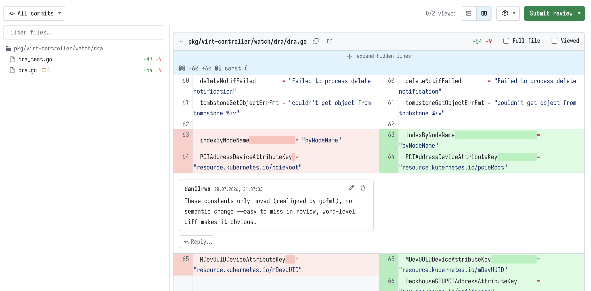
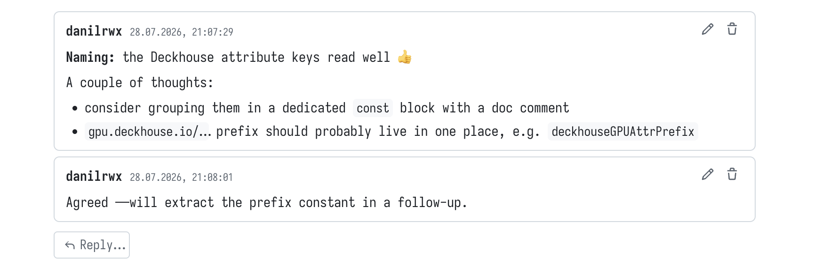
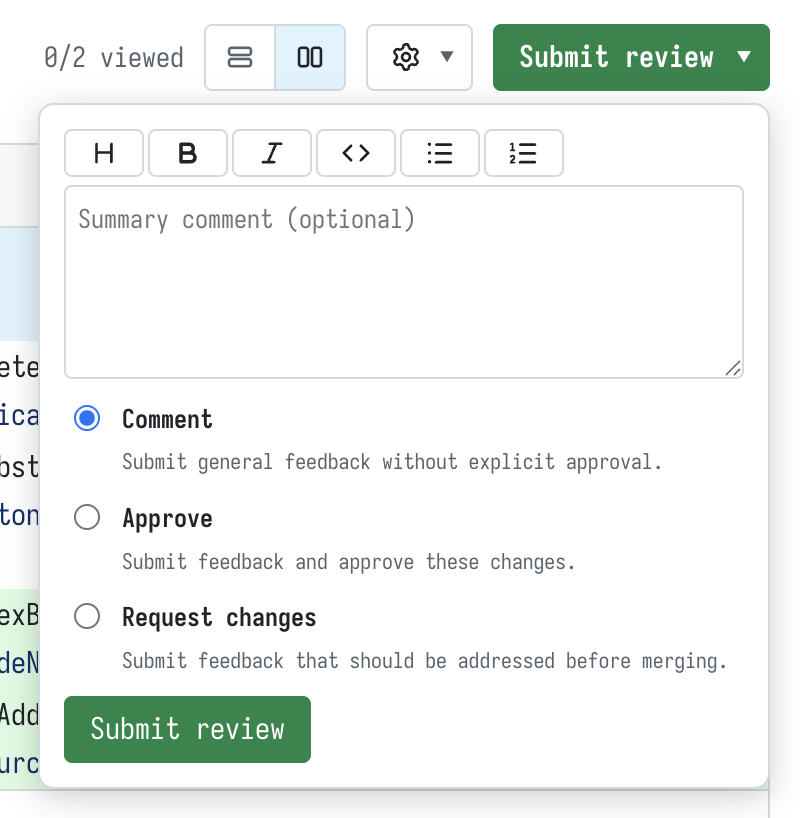
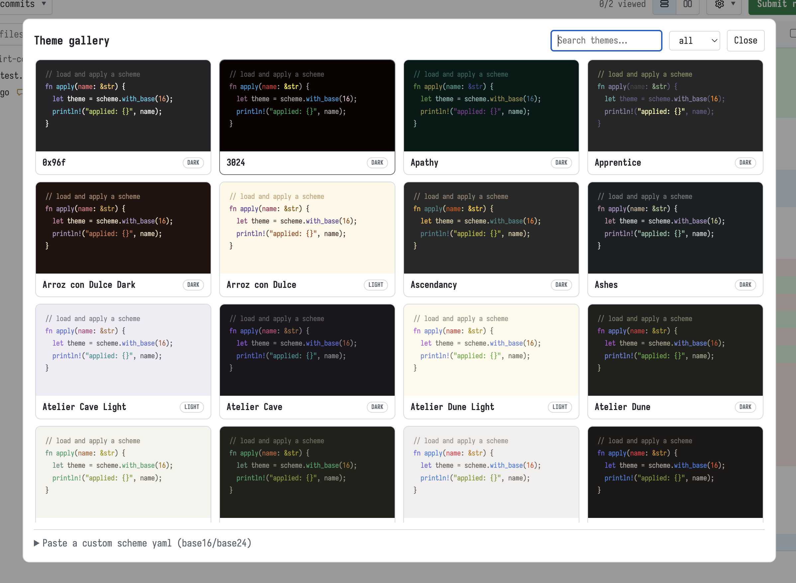

# User guide

patchtree turns a raw `.diff` / `.patch` page into a full code-review UI. This
guide walks through using it; for installation see the
[README](../README.md#install).

## Opening a diff

patchtree activates on any plain-text `.diff` / `.patch` page:

- **GitLab** — a merge request's diff, e.g.
  `https://gitlab.example.com/group/project/-/merge_requests/104.diff`
  (works on any instance, including self-hosted).
- **GitHub** — a pull request's diff,
  `https://github.com/owner/repo/pull/123.diff`.
- **Local files** — a `.diff` / `.patch` opened via `file://`. Enable
  **Allow access to file URLs** in the extension's details page first. Local
  patches render read-only (there's no host to review against).

On an MR/PR page you can also click the toolbar icon to jump to its `.diff`.

## Reading the diff

- **File tree** (left) — filter by name *or* diff content, jump to a file,
  see per-file `+N −M` and a comment-count badge. Drag the divider to resize.
- **Inline / side-by-side** — toggle in the toolbar; fully added or deleted
  files span the full width in split mode.
- **Word-level diff** — changed words inside a modified line pair get a
  stronger tint under the syntax colors.
- **Expand hidden lines** — click the gap between hunks to fetch and show the
  lines in between, or use **Full file** in a file's header.
- **Viewed** — tick a file as reviewed; the toolbar shows an `N/M viewed`
  counter and viewed files auto-collapse. Generated files (lock files,
  `*.pb.go`, `vendor/`, minified) start collapsed.

### Keyboard

| Key | Action |
|---|---|
| `j` / `k` | next / previous file |
| `n` / `p` | next / previous thread (centered) |
| `v` | toggle *viewed* on the current file |
| `x` | fold / unfold the current file |
| `/` | focus the file filter |

Alt-click a line number copies a permalink to that line.

## Reviewing

Review actions need an access token (see [Tokens](#tokens)); without one the
diff is read-only.

- **Comment on a line** — click a line number to open the form. Write in
  Markdown (toolbar + Write/Preview tabs).
- **Multi-line comment** — shift-click another line number to extend the range.

  
- **Suggestions** — the toolbar's suggestion button inserts a `suggestion`
  block prefilled with the line; an incoming suggestion renders as a red/green
  widget with **Apply** (GitLab) or **Dismiss**.

  
- **Reply / resolve** — reply under a thread, resolve/unresolve it; the
  **unresolved** dropdown in the toolbar jumps to each open thread.
- **Edit / delete** your own comments inline.
- **Draft reviews** (GitLab) — “Add to review” collects pending comments;
  **Submit review** publishes them with a summary and Comment / Approve /
  Request changes.

  

General (non-line) discussion renders above the first file. The toolbar also
shows pipeline/checks status and a merge-conflict indicator, and a **commit
filter** to view a single commit's diff.

## Appearance

Open the ⚙ gear menu to change the theme, fonts and layout.

- **Theme gallery** — search a large gallery of color schemes with live
  previews (including how added/removed lines will look) and a light/dark
  filter, or paste your own scheme YAML.

  
- **Fonts** — bundled UI/code fonts (JetBrains Mono, Inter, several Nerd Font
  builds) or any local font by name; separate UI/code sizes.
- **Layout** — tab width, italic comments, ligatures.

## Tokens

⚙ → **Access tokens** stores per-host credentials locally (never synced), used
only against their own host:

- **GitLab** — a personal access token with the `api` scope, per instance.
- **GitHub** — a classic token (`repo` scope) or a fine-grained token with
  *Pull requests: read & write*.

Changes take effect after reloading the diff page.

